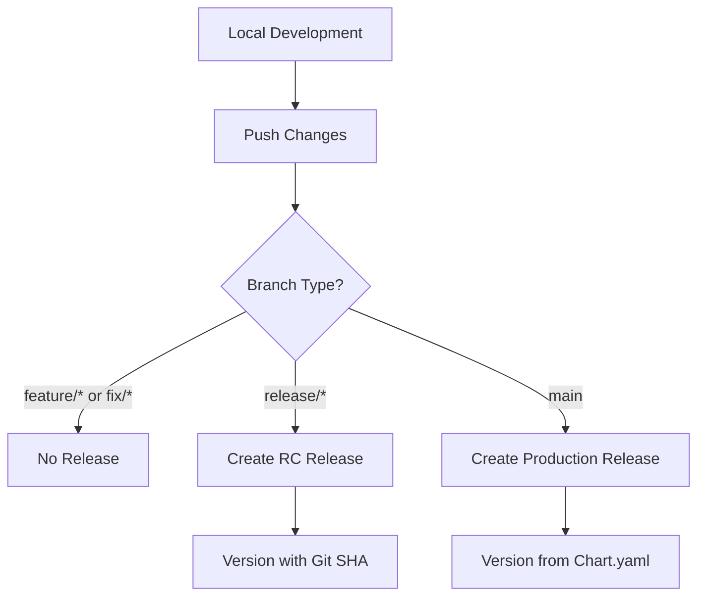

# GomezTek Mesa OS Helm Charts

[](https://github.com/gomeztek/helm-charts/actions/workflows/helm-release.yaml)
[](https://artifacthub.io/packages/search?repo=mesa)

This repository contains Helm charts for deploying GomezTek Mesa, a complete restaurant operating system.

## Development Workflow (SDLC)

### 1. Development Phase


#### Local Development
- Make changes to chart files
- Test locally using:
  ```zsh
  helm lint gtk-mesa-chart
  helm template test gtk-mesa-chart
  ```

### 2. Release Process

#### Automated Release Management
The GitHub Actions workflow automatically handles:
- Version management based on branch type
- Chart packaging and publishing to GHCR
- GitHub release and tag creation
- Cleanup of existing releases/tags for version updates

#### Feature Development
- Work on any branch
- Push changes freely
- No releases are created
```zsh
git checkout -b feature/your-feature
# Make changes
git commit -am "your changes"
git push origin feature/your-feature
```

#### Release Candidates
- Use `release/*` branches
- Automatically creates releases with SHA suffix
- Perfect for testing/staging environments
```zsh
git checkout -b release/0.1.0
# Version will be like 0.1.0-a1b2c3d
git push origin release/0.1.0
```

#### Production Releases
- Merge to `main`
- Uses version from Chart.yaml
- Creates production release
```zsh
git checkout main
git merge your-feature-branch
git push origin main
```

### 3. Version Management

#### Manual Version Bump
Use the version bump workflow:
```zsh
# Using GitHub CLI
gh workflow run version-bump --field version_type=patch
gh workflow run version-bump --field version_type=minor
gh workflow run version-bump --field version_type=major
```

### 4. Chart Distribution & Management

#### GitHub Container Registry (OCI)
```zsh
# Pull chart
helm pull oci://ghcr.io/gomeztek/charts/mesa --version 0.1.0

# Install from OCI
helm install mesa oci://ghcr.io/gomeztek/charts/mesa --version 0.1.0
```

#### Package Management Scripts

The repository includes management scripts to help with package maintenance:

```zsh
# Delete all chart versions (interactive)
.github/scripts/delete_deployments.sh

# Force delete all versions without confirmation
.github/scripts/delete_deployments.sh -f

# Delete versions for a specific owner
.github/scripts/delete_deployments.sh -o myorg

# Show help message
.github/scripts/delete_deployments.sh -h
```

Requirements for management scripts:
- `GITHUB_TOKEN` environment variable with `delete:packages` scope
- `jq` command-line JSON processor
- `curl` command-line tool

#### GitHub Pages (Traditional Helm Repository)
```zsh
# Add repository
helm repo add gomeztek https://gomeztek.github.io/helm-charts

# Install chart
helm install mesa gomeztek/mesa --version 0.1.0
```

### 5. ArgoCD Integration

```yaml
apiVersion: argoproj.io/v1alpha1
kind: Application
metadata:
  name: mesa
  namespace: argocd
spec:
  project: default
  source:
    # Using OCI Registry
    repoURL: oci://ghcr.io/gomeztek/charts
    chart: mesa
    targetRevision: 0.1.0
    # OR using Helm Repository
    # repoURL: https://gomeztek.github.io/helm-charts
    # chart: mesa
    # targetRevision: 0.1.0
  destination:
    server: https://kubernetes.default.svc
    namespace: mesa

  # For release/* branches, use targetRevision with SHA
  # targetRevision: 0.1.0-a1b2c3d
```

## Chart Structure
```
gtk-mesa-chart/
├── Chart.yaml             # Chart metadata and version
├── values.yaml           # Default configuration
├── templates/            # Kubernetes manifests
│   ├── _helpers.tpl      # Common template functions
│   ├── configmaps/       # ConfigMap resources
│   ├── cronjobs/         # CronJob resources
│   ├── rollouts/         # Argo Rollout resources
│   └── statefulsets/     # StatefulSet resources
└── ci/                   # CI/CD configuration
```

## Components
- **Backhouse Web**: Staff portal interface
- **Fronthouse Web**: Customer-facing ordering system
- **MySQL**: Database backend
- **Redis**: Caching layer
- **ArgoCD**: GitOps deployment
- **Argo Rollouts**: Blue/Green deployment strategy
